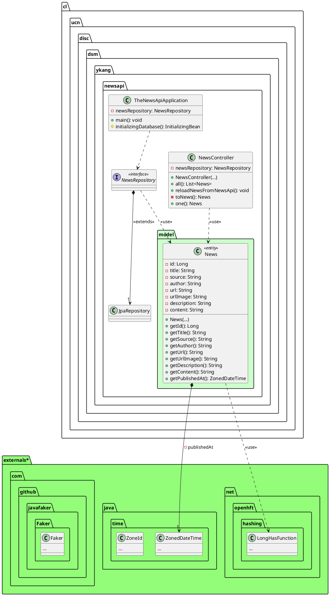

# The News API REST Project

***
(c) Youngmin Kang, 2021 Desarrollo de Soluciones Móviles

```puml
@startuml
package externals* #93FC79{
    package java.time{    
        class ZonedDateTime{
            ...
        }    
        class ZoneId{
            ...
        }
    }
    package net.openhft.hashing{
    
        class LongHasFunction{
            ...
        }
    }    
    package com.github.javafaker.Faker{
    
        class Faker{
            ...
        }
    }
}

package cl.ucn.disc.dsm.ykang.newsapi {
   package model #ccffcc{
        class News <<entity>>{
            - id: Long
            - title: String
            - source: String
            - author: String
            - url: String
            - urlImage: String
            - description: String
            - content: String
            + News(...)
            + getId(): Long
            + getTitle(): String
            + getSource(): String
            + getAuthor(): String
            + getUrl(): String
            + getUrlImage(): String
            + getDescription(): String
            + getContent(): String
            + getPublishedAt(): ZonedDateTime     
        }
        News *--> "1" ZonedDateTime : - publishedAt
        News ..> LongHasFunction : <<use>>
   }
   
        interface NewsRepository <<interface>>{
        }
        NewsRepository ..> News : <<use>>
        NewsRepository *--> "1" JpaRepository : <<extends>>
        
        class NewsController {
            -newsRepository: NewsRepository
            +NewsController(...)
            +all(): List<News>
            +reloadNewsFromNewsApi(): void
            -toNews(): News
            +one(): News
        }
        NewsController ..> News : <<use>>
        class TheNewsApiApplication {
            -newsRepository: NewsRepository
            +main(): void
            #initializingDatabase(): InitializingBean
        }
        TheNewsApiApplication ..> NewsRepository
       
  
   
}
@enduml
```

## License
[MIT](https://choosealicense.com/license/mit/)